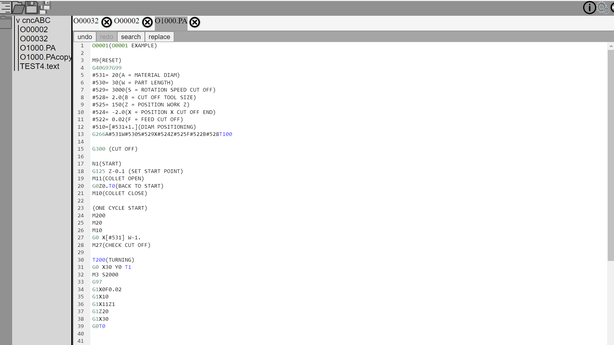
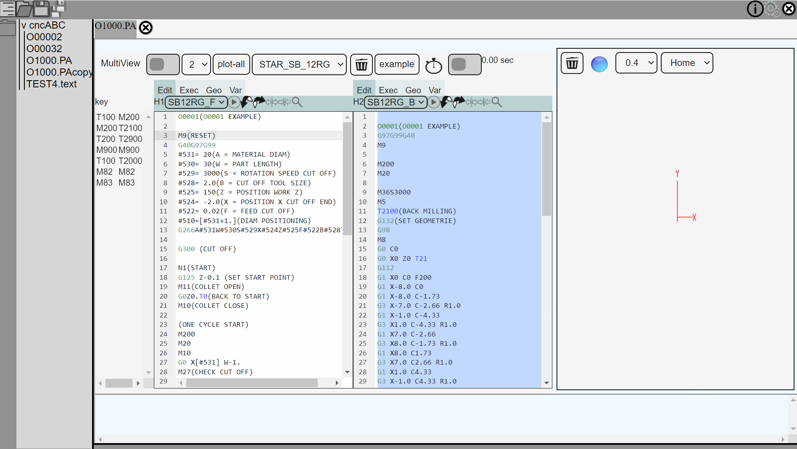

# st_tool_unit_manager

An open file manager for CNC files and more. 
The Manger offers a simple interface for opening files with various applications.
 At the moment, the focus is on files related to Star CNC machines 

The following applications are currently implemented. 
- NC Editor 
- NC-Plot
- PDF viewer







## Project setup
```
npm install
```

### Compiles and hot-reloads for development
```
npm run serve
```

### Compiles and minifies for production
```
npm run build
```

### Lints and fixes files
```
npm run lint
```


