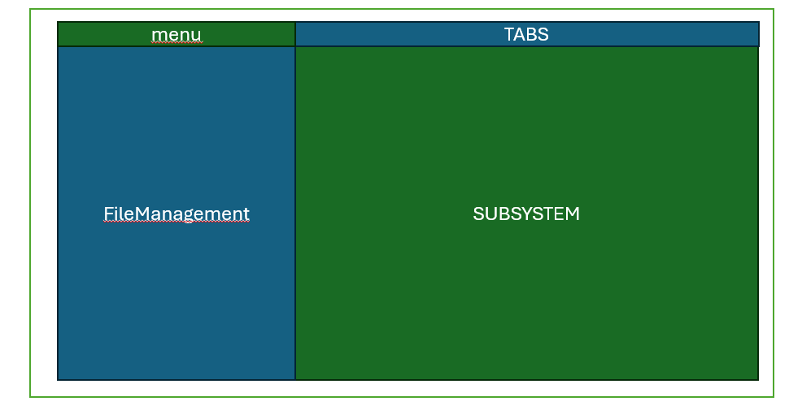

# ST_FileManager7

### Business Case

####  Initial situation

In the CNC field, there are a large number of files and procedures, and there are specific applications for each procedure.

#### idea
Now the idea is of a file manager that opens the file in the desired application in the middle 
The file manager should be a system in which files or folders on the system can be opened, moved, deleted, renamed and created.  
When opened, the system should open the file in the desired subsystem.

</img>

#### Context scenario

Franz wants to open and edit a CNC programme. He also wants to edit the file with the geometry data. When editing, he would like to open something else in another file as info.